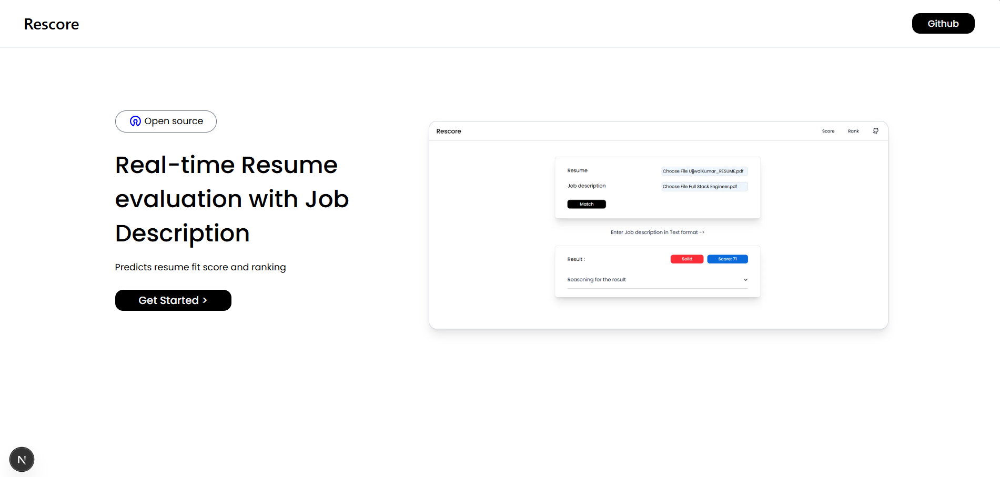

# Resume score

Resume score is a tool that evaluates how well resumes match with job descriptions.

## Features

- Real-time resume and JD matching
- Deep analysis of resumes
- Rank multiple resumes for a single JD
- Provides category and score

## Tech Stacks

- **Frontend**: Next.js, TypeScript, TailwindCSS
- **Backend**: https://github.com/UjjwalKumar02/Resume-score-backend

 

#### Feel free to connect for suggestions and collaboration.